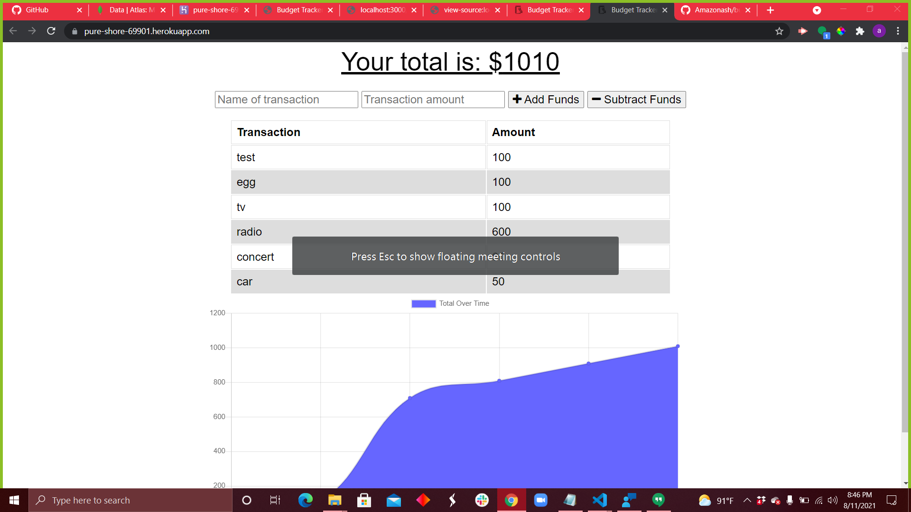

# Tech Blog
  
  ## Description
 Allow you to keep track of budget 

  * Used Week 18 mini project as a guide for this hw

## Link to Application
[app](https://pure-shore-69901.herokuapp.com/)

## Example

  ## Table of contents
  
  * [Usage](#usage)
  * [Contributing](#contributing)
  * [Installation](#installation)
  * [Testing](#testing)
  * [License](#license)
  * [Question](#question)
  
  ## Usage
   Allow you to keep track of budget 

  ## Contributing
  Create a git hub issue

  ## Installation
  to install dependencies:
  npm i

  

  ## License
  MIT
  

 ## Questions
 Email me at Ashleydelacruz999@gmail.com or Git Hub Amazonash
  

